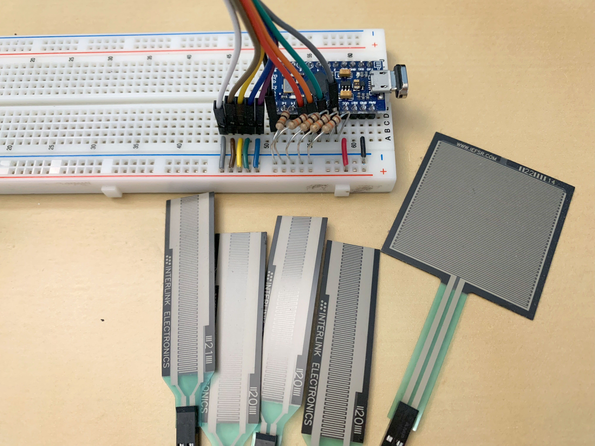

**Have you ever thought about the way you hold your mouse?**  
How about the forces needed to move your mouse, and how holding it differently might affect how well you work your way around a computer?

```{r setup, message=FALSE, warning=FALSE, include=FALSE}
knitr::opts_chunk$set(
	echo = FALSE,
	message = FALSE,
	warning = FALSE
)

library(tidyverse)
library(knitr)
```

# Project Overview

I was interested in exploring the force and performance implications of using a computer mouse with different gripping styles. For a passionate subset of the PC gaming community, mouse grip is a topic of interest that is deliberated on. In the ergonomics world, tool design and use is an area of research with the ability to improve comfort and reduce musculoskeletal disorders. Despite the existence of ergonomics studies on computer mouse usage, the effects of different mouse gripping styles on biomechanics and performance have yet to be explored.

And so, the question to be answered is: **How do different gripping styles on a computer mouse affect force distribution and performance?**

Let's find out!

## First, what do you mean by mouse grip?

Essentially, it's how people hold and support their mouse.  
There are three mouse grip styles that people are most familiar with:

* **Fingertip** grip: Hold mouse with **fingertips**, no contact with back of mouse
* **Claw** grip: Hold mouse with **fingertips**, support back of mouse **with palm** 
* **Palm** grip: Rest **fingers and palm** on mouse

Here's a visualization for a better picture of what these grips look like:
  
Source: [Electronics Hub](https://www.electronicshub.org/mouse-grip-styles/)

***

# Summary

**TLDR: The *palm* grip gives a balance of good performance with low forces. At the cost of higher force exertion, the *claw* grip provides a slight improvement in performance.**

## Forces
Across the board, the forces exerted on the *palm* grip are low and relatively equal. While the *fingertip* and *claw* grips are similar, the *claw* grip exerts greater force on the mouse body compared to the *fingertip*, which should be expected given the fingertip grip's lack of support on the back of the mouse. Perhaps surprisingly, the *claw* grip exerts higher side forces on the mouse, despite the additional palm support (and associated force) on the mouse body.

These findings are most pronounced in the maximum forces, but hold true for the median forces (representing their typical force exertion) as well.


Plots of average force measurements from the maximum and median values per trial.  
Please note the right mouse button was not used as input during the Fitt's tasks during which the data were collected.

### Tables
```{r create_forces_table, message=FALSE, warning=FALSE, include=FALSE}
forces <- read.csv("forces.csv") %>%
  mutate(across(participant:trial, factor),
         grip = relevel(grip, "fingertip", "claw", "palm")) %>%
  select(participant:F5) %>%
  rename(lside = F1, lclick = F2, rclick = F3, rside = F4, body = F5) %>%
  pivot_longer(cols = lside:body, names_to = "section", values_to = "force")

forces_tbl <- forces %>% 
  group_by(grip, trial, section) %>%
  summarise(median = median(force),
            max = max(force)) %>%
  group_by(grip, section) %>%
  summarise(median = mean(median),
            max = mean(max))

```

#### Median forces (N):
```{r forces_median_table}
forces_tbl %>%
  select(-max) %>%
  mutate(median = round(median, digits = 2)) %>%
  spread(key = section, value = median) %>%
  kable()
```

#### Maximum forces (N):
```{r forces_max_tbl}
forces_tbl %>%
  select(-median) %>%
  mutate(max = round(max, digits = 2)) %>%
  spread(key = section, value = max) %>%
  kable()
```


## Performance
How do the mouse grips impact performance?

While there are differences, they are perhaps smaller than one might think.  
Ranked from best to worst:

1. Claw
2. Palm
3. Fingertip

Here's a table with the associated **throughput (bits/s)**:

```{r performance_table}
fitts <- read.csv("fitts.csv")
fitts %>%
  group_by(Condition) %>%
  summarise(throughput = round(mean(TP.bps.), digits = 2)) %>%
  mutate(grip = case_when(Condition == "C01" ~ "fingertip",
                          Condition == "C02" ~ "claw",
                          Condition == "C03" ~ "palm")) %>%
  select(grip, throughput) %>%
  kable()
```
These values were obtained by performing 2-Dimensional Fitt's tasks with combinations of different target widths and distances. Throughput essentially assesses the speed-accuracy trade-off in human movement, and is a go-to method for measuring input device performance. 

***

# Detailed Steps

I carried out the following steps in the process of answering the research question:

1) Connected force sensors to an Arduino
2) Calibrated the sensors
3) Attached the sensors to the mouse and measured forces

## 1) Connecting force sensors to Arduino

The force sensors (more appropriately referred to as force sensitive resistors, or FSRs) were wired to the Arduino with a bread board such that increasing force would increase the analog reading. A great hookup guide (and an excellent resource overall) to create the voltage divider that is the foundation for this behaviour can be located [here from the Makeability lab](https://makeabilitylab.github.io/physcomp/arduino/force-sensitive-resistors.html#using-fsrs-with-microcontrollers). Beyond the sensors, another decision that was made is the value of the fixed resistor used to create the voltage divider. A 10K Ohm resistor was selected for its good range across the sensing range of the FSR, as well as the sensitivity it offers at the lower end of force, where I expected the mouse grip forces to predominantly reside.




## 2) Calibration
The calibration step involved using a set of calibration masses to determine the analog value associated with a given mass. Analog values ranged from 0-1023 because the Arduino that was used possesses an analog to digital converter with a 10-bit resolution (2^10 = 1024). Due to the small physical dimensions of the sensors, only a limited number of calibration masses could be placed at once. A measurement was taken every 2 seconds over a 10 second window, so the average of 5 data points was taken as the analog measurement for a given mass. Linear interpolation was used to approximate mass when analog measurements fell between calibration values. Collected values were then converted to force, the main biomechanical outcome of interest. 


## 3) Measuring forces
Sensors were attached to a modified Logitech G703 mouse on the left side, left click, right click, right side, and body. The mouse was held using three grips (fingertip, claw, and palm) while performing Fitts point and click tasks across a range of difficulties. Data from the force sensors was collected with a sampling rate of 100 Hz.

Plots were made by overlaying an image of the mouse with a shapefile, effectively creating a heat map of the forces exerted on the different sections of the mouse. Details will be provided in the mouse_shapefile folder.

