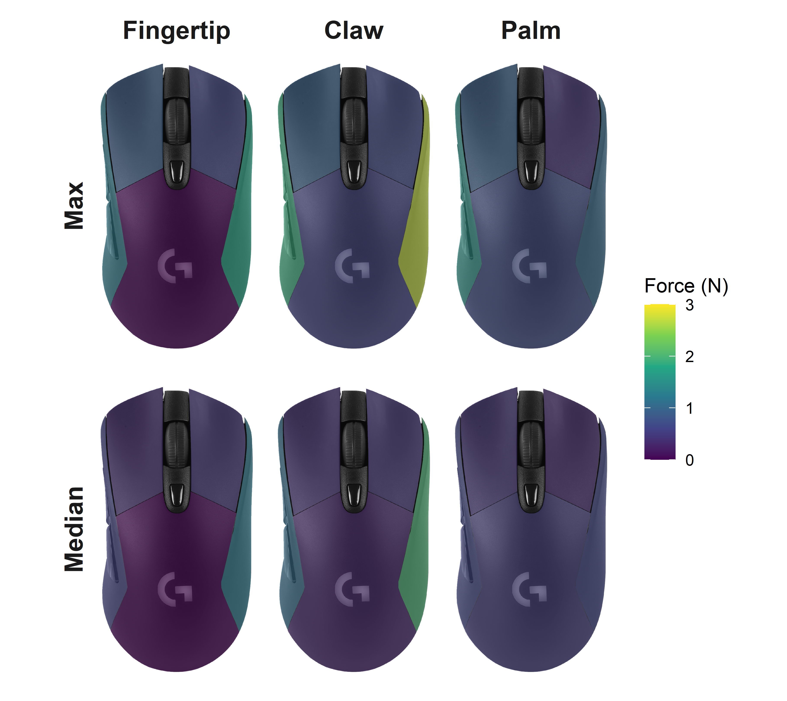

# Project Overview

I was interested in exploring the force and performance implications of using a computer mouse with different gripping styles. For a passionate subset of the PC gaming community, mouse grip is a topic of interest that is deliberated on. In the ergonomics world, tool design and use is an area of research with the ability to improve comfort and reduce musculoskeletal disorders. Despite the existence of ergonomics studies on computer mouse usage, the effects of different mouse gripping styles on biomechanics and performance have yet to be explored.

And so, the question to be answered is: **How do different gripping styles on a computer mouse affect force distribution and performance?**

Let's find out!

## First, what do you mean by mouse grip?

Essentially, it's how people hold and support their mouse.  
There are three mouse grip styles that people are most familiar with:

* Fingertip grip: Hold mouse with **fingertips**, no contact with back of mouse
* Claw grip: Hold mouse with **fingertips**, support back of mouse **with palm** 
* Palm grip: Rest **fingers and palm** on mouse

Here's a visualization for a better picture of what these grips look like:
  
Source: [Electronics Hub](https://www.electronicshub.org/mouse-grip-styles/)

***

# Summary

Across the board, the *palm* grip appears to exert the lowest forces. While the *fingertip* and *claw* grips are similar, the *claw* grip exerts greater force on the mouse body compared to the *fingertip*, which should be expected given the lack of support of the fingertip grip on the back of the mouse. Surprisingly, the *claw* grip exerts higher side forces on the mouse, despite the additional palm support (and associated force) on the mouse body.

These findings are most pronounced in the maximum forces, but hold true for the median forces as well.

Averaged force measurements from the max and median values per trial

***

# Detailed Steps

I carried out the following steps in the process of answering the research question:

1) Connected force sensors to an Arduino
2) Calibrated the sensors
3) Attached the sensors to the mouse and measured forces

## 1) Connecting force sensors to Arduino

## 2) Calibration
The calibration step involved using a set of calibration masses to determine the analog value associated with a given mass. Analog values ranged from 0-1023 because the Arduino that was used possesses an analog to digital converter with a 10-bit resolution (2^10 = 1024). Due to the small physical dimensions of the sensors, only a limited number of calibration masses could be placed at once. A measurement was taken every 2 seconds over a 10 second window, so the average of 5 data points was taken as the analog measurement for a given mass. Linear interpolation was used to approximate mass when analog measurements fell between calibration values. Collected values were then converted to force, the main biomechanical outcome of interest. 

## 3) Measuring forces
Sensors were attached to a modified Logitech G703 mouse on the left side, left click, right click, right side, and body. The mouse was held using three grips (fingertip, claw, and palm) while performing Fitts point and click tasks across a range of difficulties. Data from the force sensors was collected with a sampling rate of 100 Hz.

Plots were created by overlaying an image of the mouse with a shapefile, effectively making a heat map of the forces exerted on the different sections of the mouse. 