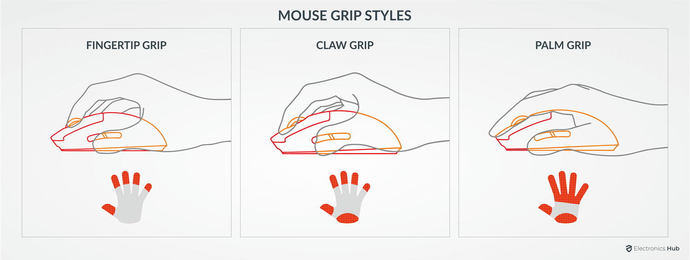
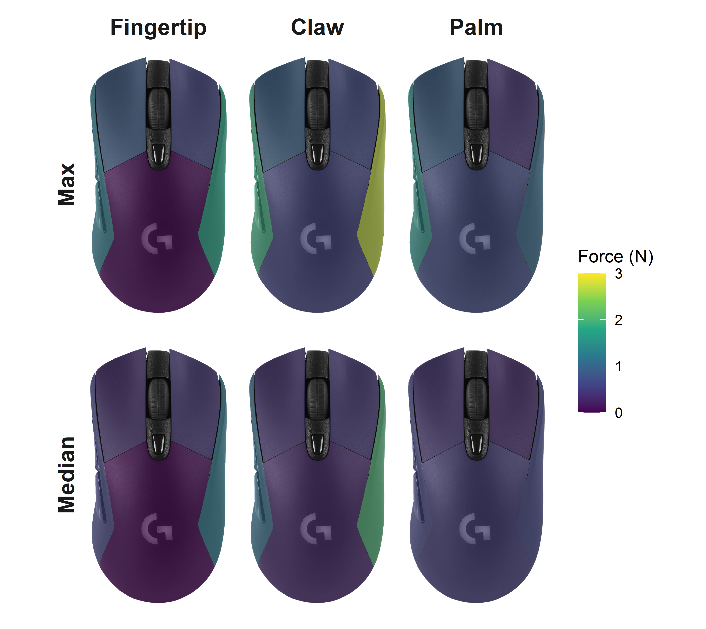
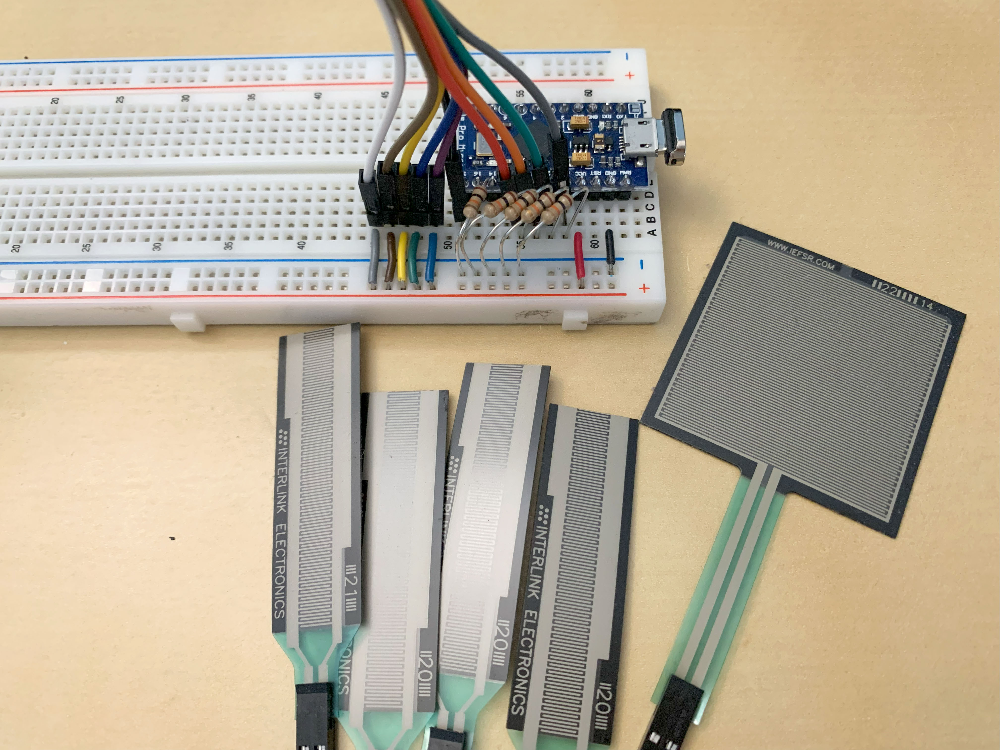
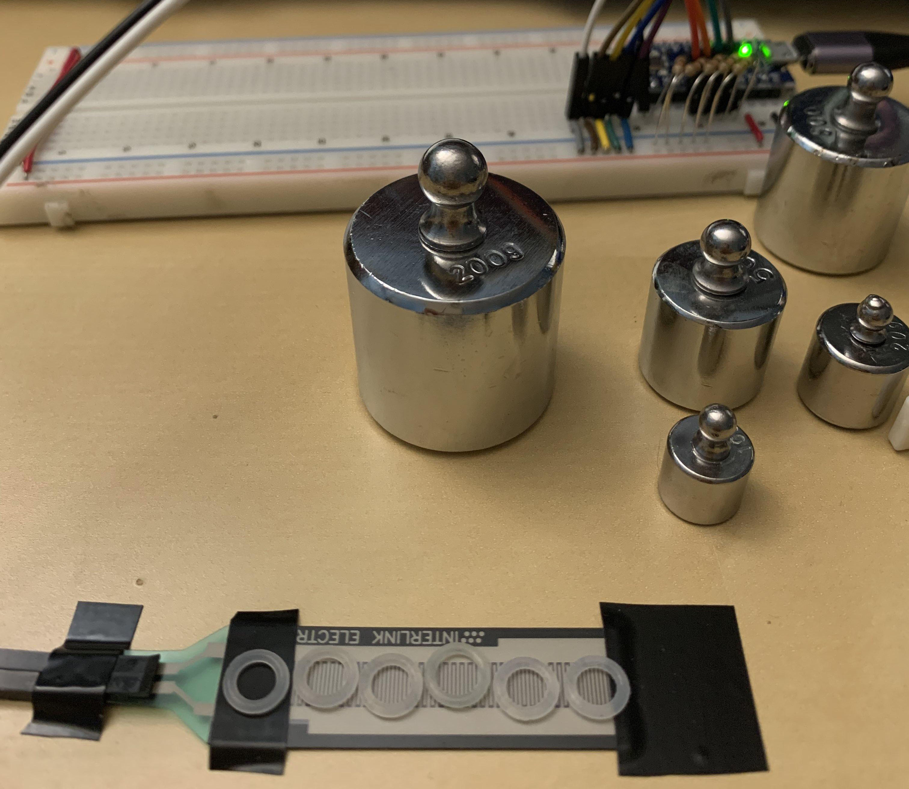

Mouse Grip Forces & Performance
================
Andrew Y.W. Wong

**Have you ever thought about the way you hold your mouse?**  
How about the forces needed to move your mouse, and how holding it
differently might affect how well you work your way around a computer?

# Project Overview

I was interested in exploring the force and performance implications of
using a computer mouse with different gripping styles. For a passionate
subset of the PC gaming community, mouse grip is a topic of interest
that is deliberated on. In the ergonomics world, tool design and use is
an area of research with the ability to improve comfort and reduce
musculoskeletal disorders. Despite the existence of ergonomics studies
on computer mouse usage, the effects of different mouse gripping styles
on biomechanics and performance have yet to be explored.

And so, the question to be answered is: **How do different gripping
styles on a computer mouse affect force distribution and performance?**

Let’s find out!

## First, what do you mean by mouse grip?

Essentially, it’s how people hold and support their mouse.  
There are three mouse grip styles that people are most familiar with:

- **Fingertip** grip: Hold mouse with **fingertips**, no contact with
  back of mouse
- **Claw** grip: Hold mouse with **fingertips**, support back of mouse
  **with palm**
- **Palm** grip: Rest **fingers and palm** on mouse

Here’s a visualization for a better picture of what these grips look
like:   
Source: [Electronics
Hub](https://www.electronicshub.org/mouse-grip-styles/)

------------------------------------------------------------------------

# Summary

**TLDR: The *palm* grip gives a balance of good performance with low
forces. At the cost of higher force exertion, the *claw* grip provides a
slight improvement in performance.**

## Forces

Across the board, the forces exerted on the *palm* grip are low and
relatively equal. While the *fingertip* and *claw* grips are similar,
the *claw* grip exerts greater force on the mouse body compared to the
*fingertip*, which should be expected given the fingertip grip’s lack of
support on the back of the mouse. Perhaps surprisingly, the *claw* grip
exerts higher side forces on the mouse, despite the additional palm
support (and associated force) on the mouse body.

These findings are most pronounced in the maximum forces, but hold true
for the median forces (representing their typical force exertion) as
well.

 Plots of average force measurements from
the maximum and median values per trial.  
Please note the right mouse button was not used as input during the
Fitt’s tasks during which the data were collected.

### Tables

#### Median forces (N):

| grip      | body | lclick | lside | rclick | rside |
|:----------|-----:|-------:|------:|-------:|------:|
| fingertip | 0.00 |   0.35 |  0.59 |   0.45 |  1.23 |
| claw      | 0.28 |   0.41 |  1.08 |   0.46 |  2.00 |
| palm      | 0.51 |   0.43 |  0.60 |   0.32 |  0.60 |

#### Maximum forces (N):

| grip      | body | lclick | lside | rclick | rside |
|:----------|-----:|-------:|------:|-------:|------:|
| fingertip | 0.00 |   0.88 |  1.23 |   0.60 |  1.77 |
| claw      | 0.58 |   0.94 |  1.88 |   0.66 |  2.72 |
| palm      | 0.68 |   0.94 |  1.53 |   0.43 |  1.05 |

## Performance

How do the mouse grips impact performance?

While there are differences, they are perhaps smaller than one might
think.  
Ranked from best to worst:

1.  Claw
2.  Palm
3.  Fingertip

Here’s a table with the associated **throughput (bits/s)**:

| grip      | throughput |
|:----------|-----------:|
| fingertip |       5.94 |
| claw      |       6.28 |
| palm      |       6.14 |

These values were obtained by performing 2-Dimensional Fitt’s tasks with
combinations of different target widths and distances. Throughput
essentially assesses the speed-accuracy trade-off in human movement, and
is a go-to method for measuring input device performance.

------------------------------------------------------------------------

# Detailed Steps

I carried out the following steps in the process of answering the
research question:

1)  Connected force sensors to an Arduino
2)  Calibrated the sensors
3)  Attached the sensors to the mouse and measured forces

## 1) Connecting force sensors to Arduino

## 2) Calibration

The calibration step involved using a set of calibration masses to
determine the analog value associated with a given mass. Analog values
ranged from 0-1023 because the Arduino that was used possesses an analog
to digital converter with a 10-bit resolution (2^10 = 1024). Due to the
small physical dimensions of the sensors, only a limited number of
calibration masses could be placed at once. A measurement was taken
every 2 seconds over a 10 second window, so the average of 5 data points
was taken as the analog measurement for a given mass. Linear
interpolation was used to approximate mass when analog measurements fell
between calibration values. Collected values were then converted to
force, the main biomechanical outcome of interest.

## 3) Measuring forces

Sensors were attached to a modified Logitech G703 mouse on the left
side, left click, right click, right side, and body. The mouse was held
using three grips (fingertip, claw, and palm) while performing Fitts
point and click tasks across a range of difficulties. Data from the
force sensors was collected with a sampling rate of 100 Hz.

Plots were made by overlaying an image of the mouse with a shapefile,
effectively creating a heat map of the forces exerted on the different
sections of the mouse. Details will be provided in the mouse_shapefile
folder.
